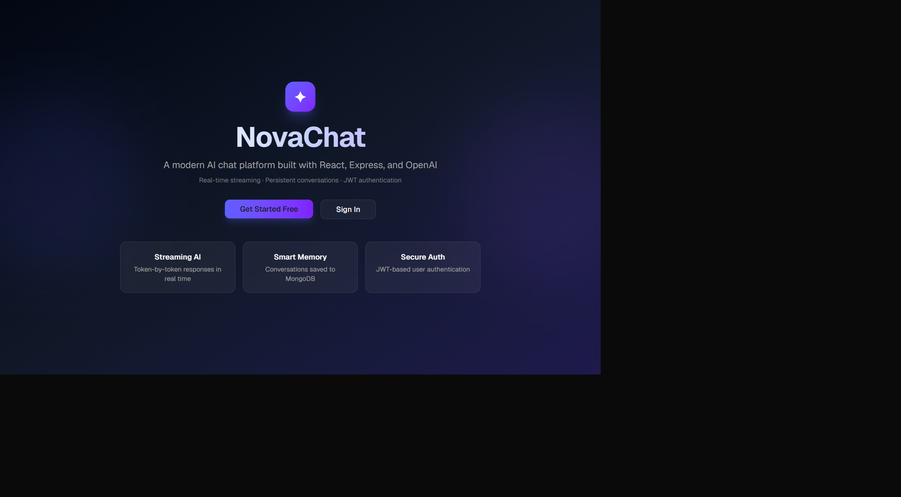
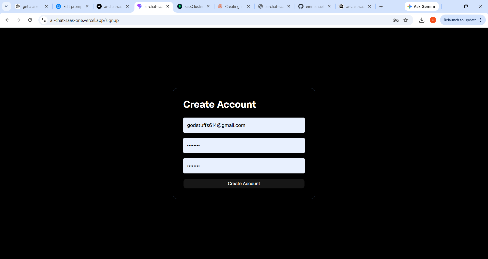
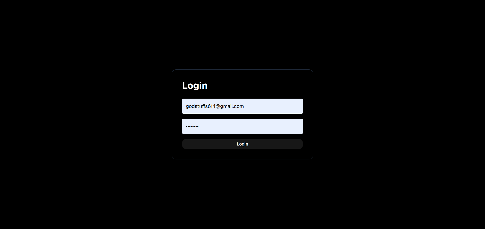
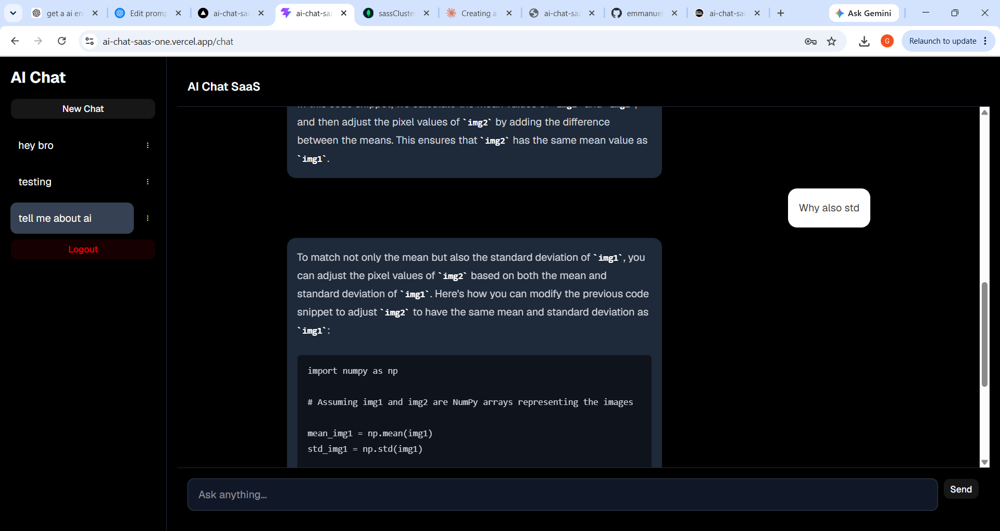

# AI Chat SaaS

A full-stack AI chat application built with React, TypeScript, Express, MongoDB Atlas, JWT authentication, and OpenAI.

## Live Demo

https://ai-chat-saas-one.vercel.app/

## Features

- User authentication with JWT
- Secure signup and login
- OpenAI-powered chat assistant
- Multiple conversations
- Persistent chat history using MongoDB Atlas
- Rename conversations
- Delete conversations
- Conversation titles generated from first message
- Responsive UI
- Railway backend deployment
- Vercel frontend deployment

## Screenshots

### Home Page



### Signup Page



### Login Page



### Chat Page



## Tech Stack

### Frontend

- React
- TypeScript
- Vite
- Tailwind CSS
- shadcn/ui

### Backend

- Node.js
- Express
- MongoDB Atlas
- Mongoose
- JWT
- bcrypt

### AI

- OpenAI API

## Architecture

React Frontend

↓

Express API

↓

MongoDB Atlas

OpenAI API

↑

Express API

## What I Learned

This project helped me gain hands-on experience with:

- Building full-stack React applications
- JWT authentication
- MongoDB data modeling
- REST API design
- OpenAI API integration
- Frontend and backend deployment
- Managing persistent chat history

## Local Setup

```bash
git clone <repo-url>
cd ai-chat-saas
npm install
```

Frontend:

```bash
npm run dev
```

Backend:

```bash
cd server
npm install
npm start
```

## Author

Emmanuel Olabisi